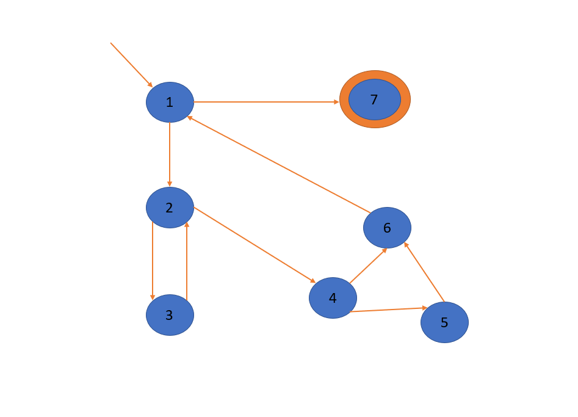

### N = {1, 2, 3, 4, 5, 6, 7}
### N0 = {1}
### Nf = {7}
### E = {(1, 2), (1, 7), (2, 3), (2, 4), (3, 2), (4, 5), (4, 6), (5, 6), (6, 1)}
### p1 = [1, 2, 4, 5, 6, 1, 7]
### p2 = [1, 2, 3, 2, 4, 6, 1, 7]
### p3 = [1, 2, 3, 2, 4, 5, 6, 1, 7]

(a) Draw the graph.

(b) List the test requirements for Edge-Pair Coverage.
[1, 2, 3], [1, 2, 4], [2, 3, 2], [2, 4, 5], [2, 4, 6], [3, 2, 3], [3, 2, 4], [4, 5, 6], [4, 6, 1], [5, 6, 1], [6, 1, 2], [6, 1, 7]
 
(c) Does the given set of test paths satisfy Edge-Pair Coverage? If not, state what is missing.
Các đường dẫn kiểm thử p1, p2, p3 không thỏa mãn độ bao phủ cặp cạnh.

(d) Consider the simple path [3, 2, 4, 5, 6] and test path [1, 2, 3, 2, 4, 6, 1, 2, 4, 5, 6, 1, 7]. Does the test path tour the simple path directly? With a sidetrip? If so, write down the sidetrip.
Đường dẫn [1, 2, 3, 2, 4, 6, 1, 2, 4, 5, 6, 1, 7] ghé thăm [3, 2, 4, 5, 6].

(e) List the test requirements for Node Coverage, Edge Coverage, and Prime Path Coverage on the graph.
Các yêu cầu kiểm thử cho bao phủ :
- Theo nút: 1,2,3,4,5,6,7
- Theo cạnh: (1,2), (1,7), (2,3), (2,4), (3,2), (4,5), (4,6), (5,6), (6,1)
- Bao phủ đường đi nguyên tố: [1,7], [2,3,2], [5,6,1,2,4,5] ,  [1,2,3,2], [5,6,1,7], [1,2,4,6,1], [2,4,6,1,7], [2,4,6,1,2], [1,2,4,5,6,1], [2,4,5,6,1,2], [2,4,5,6,1,7]

(f) List test paths from the given set that achieve Node Coverage but not Edge Coverage on the graph.
p3 = [1, 2, 3, 2, 4, 5, 6, 1, 7]

(g) List test paths from the given set that achieve Edge Coverage but not Prime Path Coverage on the graph.
p1 = [1, 2, 4, 5, 6, 1, 7]
